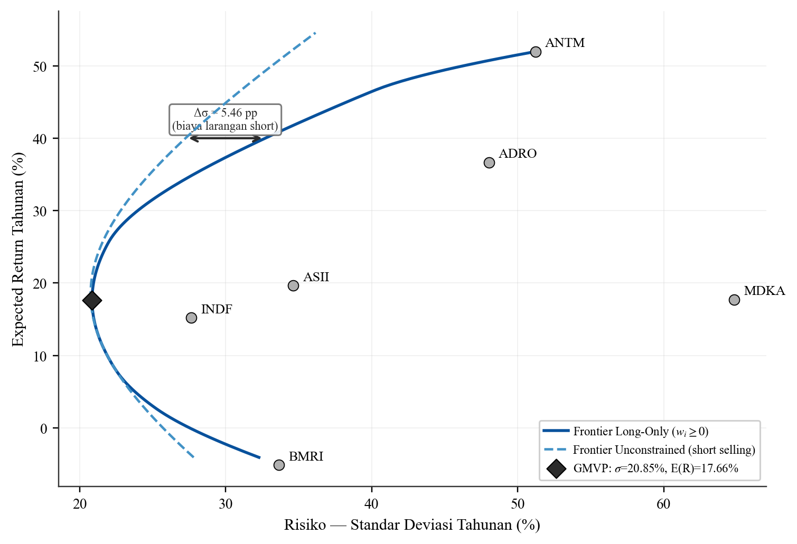
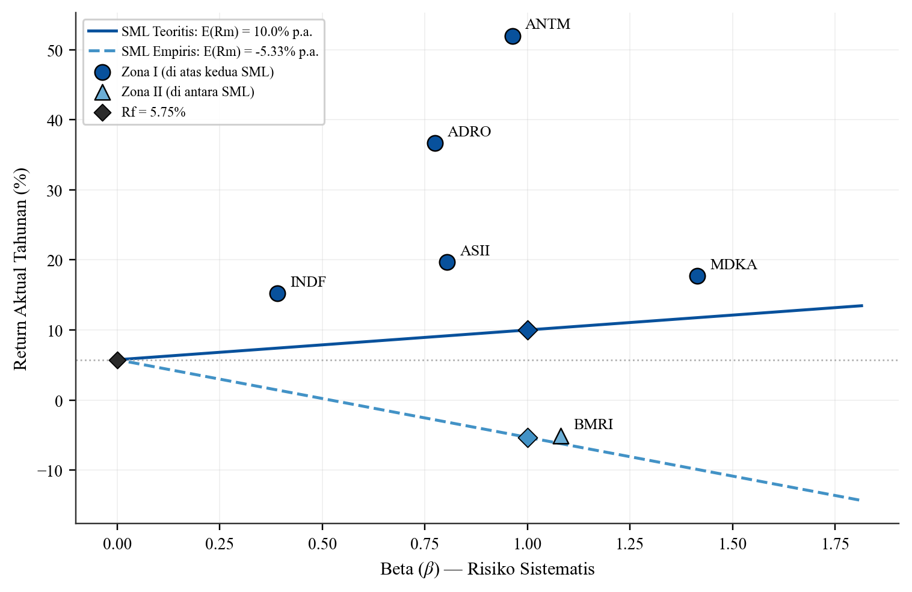
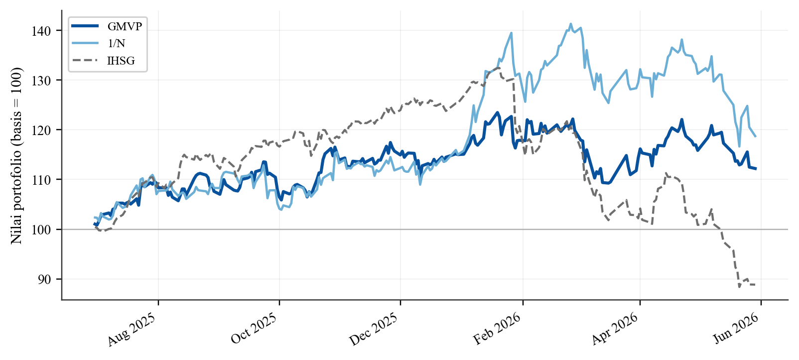
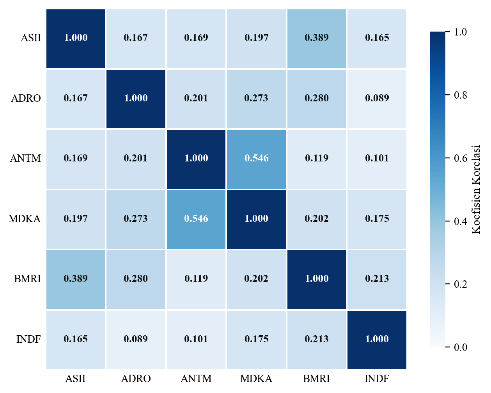

# Optimasi Portofolio Saham BEI — Markowitz & CAPM

Mini Project Matematika Finansial Lanjut. Membangun dan mengevaluasi portofolio
optimal dari 6 saham Bursa Efek Indonesia (BEI) menggunakan teori portofolio
**Markowitz** (Global Minimum Variance Portfolio / GMVP, *efficient frontier*)
dan **CAPM / Dual Securities Market Line (SML)**, lengkap dengan validasi
*out-of-sample* dan analisis sensitivitas BI Rate.

- **Universum**: ASII, ADRO, ANTM, MDKA, BMRI, INDF — dipilih dari skrining 11
  sektor BEI (lihat `sector_analysis.py`).
- **Pasar (benchmark)**: IHSG (`^JKSE`).
- **Periode**: Juni 2024 – Mei 2026 (data harian).
- **Risk-free**: BI Rate 5,75%/tahun (baseline; diuji pada 4,50% & 7,00%).
- **Modal**: Rp100.000.000.

**Penulis:** Iqbal Prakusa Hartanto — Mini Project Matematika Finansial Lanjut.

## Struktur Proyek

```
.
├── common.py              # MESIN perhitungan bersama (single source of truth)
├── figures.py             # semua figur paper (Gambar 1–6) -> outputs/
├── calculation.py         # cetak seluruh angka kunci paper
├── sector_analysis.py     # Tabel 1 — skrining kinerja 11 sektor BEI
├── main.py                # orkestrator: jalankan semua proses analisis
├── data/
│   └── prices_cache.csv   # data harga ter-pin (agar hasil reproducible)
├── outputs/               # figur paper + tabel sektor (dapat diregenerasi)
├── paper/
│   └── paper.pdf          # laporan final
├── requirements.txt
└── README.md
```

### Arsitektur (DRY)

Seluruh rumus inti ditulis **satu kali** di `common.py` lalu diimpor oleh
`figures.py` dan `calculation.py`, sehingga angka di figur, lembar bukti,
dan paper dijamin konsisten.

```
            common.py  (mesin — diimpor)
            ↑        ↑
    figures.py    calculation.py
            ↑        ↑          ↑
            └── main.py ────────┴── sector_analysis.py (mandiri)
```

## Instalasi

```bash
python -m venv .venv
# Windows: .venv\Scripts\activate   |   Linux/macOS: source .venv/bin/activate
pip install -r requirements.txt
```

## Cara Menjalankan

Jalankan seluruh pipeline (skrining sektor → figur → cetak angka):

```bash
python main.py
```

Atau per-bagian:

```bash
python sector_analysis.py     # Tabel 1 -> outputs/sector_metrics.csv + baris LaTeX
python figures.py             # 6 figur paper -> outputs/
python calculation.py         # cetak angka kunci ke konsol
```

## Output

| Berkas | Keterangan |
|--------|------------|
| `outputs/fig0_ihsg_trend.png` | Gambar 1 — tren IHSG & BI Rate |
| `outputs/fig6_normalized_prices.png` | Gambar 2 — harga 6 saham + IHSG (basis 100) |
| `outputs/fig1_correlation_heatmap.png` | Gambar 3 — heatmap korelasi |
| `outputs/fig3_efficient_frontier.png` | Gambar 4 — efficient frontier (LO vs short) + Δσ |
| `outputs/fig2_dual_sml_plot.png` | Gambar 5 — Dual SML (teoritis vs empiris) + 3 zona |
| `outputs/fig5_oos_equity.png` | Gambar 6 — equity curve out-of-sample |
| `outputs/sector_metrics.csv` | data Tabel 1 (kinerja 11 sektor) |

## Hasil (Pratinjau)

**Efficient Frontier — Long-Only vs Short-Selling, beserta biaya larangan short (Δσ)**



**Dual Securities Market Line — klasifikasi 3 zona (teoritis vs empiris)**



**Validasi Out-of-Sample — GMVP vs Ekual-Weight (1/N) vs IHSG**



**Matriks Korelasi Return Harian**



## Catatan Data & Reproduktibilitas

`common.py` mengunduh harga dari Yahoo Finance, lalu meng-cache ke
`data/prices_cache.csv`. Berkas cache ini **sengaja di-commit** agar siapa pun
memperoleh angka yang sama persis seperti di paper. Untuk menarik data terbaru,
hapus `data/prices_cache.csv` lalu jalankan ulang (angka akan menyesuaikan data
pasar terkini).

## Lisensi

Dirilis di bawah [Lisensi MIT](LICENSE) © 2026 Iqbal Prakusa Hartanto.
Bebas digunakan, dimodifikasi, dan disebarkan selama mencantumkan atribusi;
tanpa garansi. Dibuat untuk tujuan edukasi/akademik.
